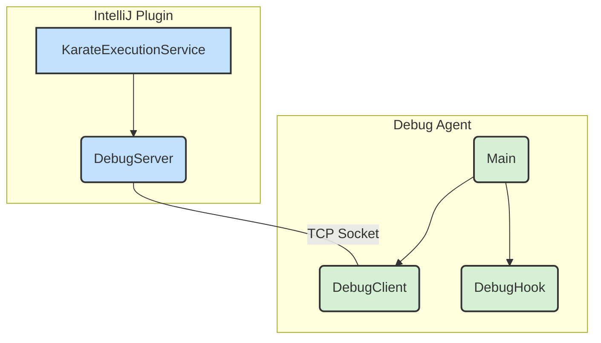
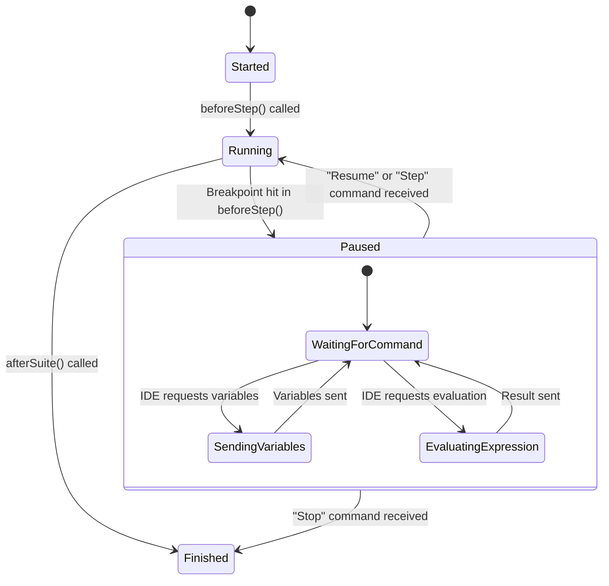

# Debug Agent Internals

This document explains the inner workings of the Karate Chop Debug Agent, a lightweight Java agent that enables debugging of Karate tests from within IntelliJ.

## Overview

The debug agent is the bridge between the Karate test runner and the IntelliJ plugin. It is responsible for:

1.  **Execution Hooking:** Intercepting the test execution at each step using Karate's native `RuntimeHook` interface.
2.  **Communication:** Exchanging information with the IDE, such as breakpoint hits and variable states.
3.  **State Management & Locking:** Pausing and resuming the test execution thread to allow for interactive debugging.

## Architecture

The system is composed of two main parts: the **IntelliJ Plugin** and the **Debug Agent**. They communicate over a TCP socket to exchange commands and state information.

## How It Works

When a debug session starts, the `KarateExecutionService` in the IDE launches the `Debug Agent` as a separate Java process. The agent's `Main` class then starts a `DebugClient` to connect back to the `DebugServer` in the IDE.

### 1. Execution Hooking via `DebugHook`

Instead of using complex bytecode instrumentation, the agent leverages Karate's built-in hook system. The `DebugHook` class is the core of the agent, and its `beforeStep` method is called by Karate before each step in a `.feature` file is executed.

### 2. Pausing Execution with a `CountDownLatch`

Inside `beforeStep`, the hook checks if the current step's line number matches an active breakpoint. If so, it pauses the execution thread using a `java.util.concurrent.CountDownLatch`.

By calling `latch.await()`, the `DebugHook` effectively freezes the Karate test runner, waiting for a command from the IDE.

## Debugger State Lifecycle

The `DebugHook` manages the state of the debugger throughout the test execution. The following diagram illustrates the lifecycle:

This locking and state management mechanism provides a simple yet powerful way to control the execution flow without altering the underlying Karate code.
